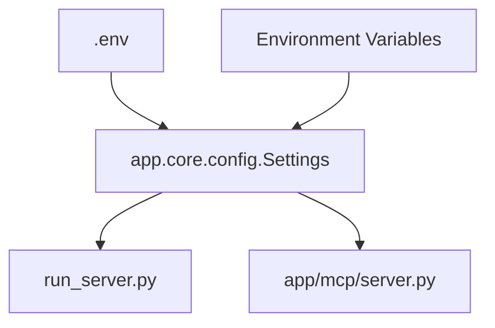

# DESIGN_config_update

## 1. 模块设计

### 1.1 `app/core/config.py`
*   **职责**: 定义所有配置项及其默认值。
*   **变更**: 新增 `HOST` (str) 和 `PORT` (int) 字段。

### 1.2 `run_server.py`
*   **职责**: 应用程序入口点。
*   **变更**: 导入 `settings`，将 `uvicorn.run` 的参数替换为配置项。

### 1.3 `app/mcp/server.py`
*   **职责**: 定义 MCP 服务实例。
*   **变更**: 使用 `settings` 中的配置初始化 `FastMCP`。

## 2. 数据流

## 3. 影响范围
*   服务启动参数。
*   MCP 服务注册参数。
*   无数据库 schema 变更。
*   无对外 API 接口变更（仅端口可能变化）。
