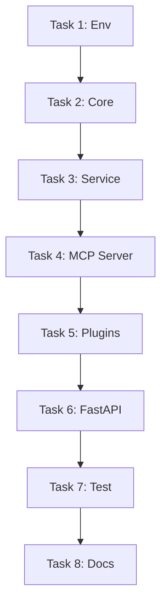

# TASK_init_project

## 1. 任务清单

### Task 1: 环境配置
- [ ] 创建 `environment.yml` (Conda)
- [ ] 创建 `requirements.txt` (Pip)
- [ ] 创建 `.gitignore`
- [ ] 创建 `.env.example`

### Task 2: 核心基础组件
- [ ] 实现 `app/core/config.py`: 配置加载
- [ ] 实现 `app/core/logger.py`: 日志配置

### Task 3: 业务服务层
- [ ] 实现 `app/services/echo_service.py`: 示例业务逻辑

### Task 4: MCP 服务核心
- [ ] 实现 `app/mcp/server.py`: FastMCP 实例初始化

### Task 5: 插件实现
- [ ] 实现 `app/plugins/echo.py`: 注册 Echo 工具

### Task 6: FastAPI 集成
- [ ] 实现 `app/main.py`: 挂载 MCP SSE 服务

### Task 7: 测试与验证
- [ ] 实现 `tests/test_echo.py`: 单元测试
- [ ] 运行测试并生成报告

### Task 8: 文档编写
- [ ] 更新 `README.md`: 项目介绍与启动指南
- [ ] 创建 `docs/DEPLOY.md`: 部署文档

## 2. 依赖关系图

