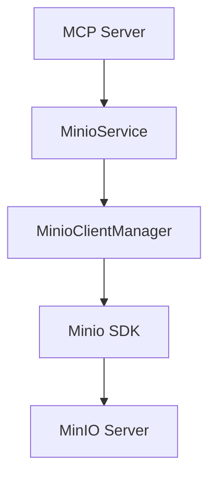

# Design Document - MinIO Service

## 1. System Architecture

## 2. Module Design

### 2.1 Configuration (`app/core/config.py`)
Add `MinioSettings`:
- `MINIO_ENDPOINT`: str
- `MINIO_ACCESS_KEY`: str
- `MINIO_SECRET_KEY`: str
- `MINIO_SECURE`: bool
- `MINIO_BUCKET_NAME`: str
- `MINIO_POOL_MAX_SIZE`: int (default 10)

### 2.2 Connection Manager (`app/core/minio_client.py`)
Class `MinioClientManager`:
- **Attributes**: `_client`, `_pool_manager`
- **Methods**:
    - `get_client() -> Minio`: Returns lazy-loaded client.
    - `init_pool()`: Configures `urllib3` pool.
    - `health_check() -> bool`: Pings server.

### 2.3 Service Layer (`app/services/minio_service.py`)
Class `MinioService`:
- **Methods** (Async):
    - `upload_file(file: bytes, filename: str) -> Dict`
    - `delete_file(object_name: str) -> Dict`
    - `get_file_info(object_name: str) -> Dict`
    - `generate_preview_url(object_name: str) -> str`
- **Helper Methods**:
    - `validate_file(file: bytes, filename: str)`
    - `generate_object_name(filename: str)`

## 3. Data Flow
1. **Upload**: User -> MCP -> `MinioService.upload_file` -> (Validation) -> `to_thread(client.put_object)` -> MinIO.
2. **Response**: MinIO -> SDK -> Service -> User (JSON result).

## 4. Exception Handling
- Wrap `S3Error` in `FileUploadError`, `FileDownloadError`.
- Log errors with traceback and context.

## 5. Logging
- Use `logger.bind(context=...)` for contextual logging.
- JSON format via Loguru.
