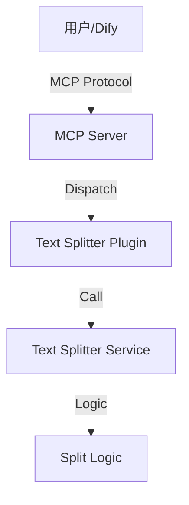

# 架构设计文档：文本分块服务 MCP 工具化

## 1. 整体架构
采用项目现有的分层架构：
- **Interface Layer (Plugin)**: 定义 MCP 工具接口，处理参数接收和响应格式化。
- **Business Layer (Service)**: 封装核心业务逻辑，实现具体的文本分块算法。



## 2. 模块设计

### 2.1 TextSplitterService (`app/services/text_splitter_service.py`)
- **类名**: `TextSplitterService`
- **主要方法**:
    - `split(self, mode: str, content: str, parent_block_size: int, sub_block_size: int, preview_url: str) -> dict`
- **辅助方法** (移植自 `doc_spliter.py`):
    - `_protect_special_tokens`
    - `_restore_special_tokens`
    - `_convert_html_tables_to_markdown`
    - `_extract_md_header_prefix_and_body`
    - `_split_into_units`
    - `_join_units_with_limit`
    - `_render_units`
    - `_apply_subblock_separators`
    - `split_pdf_text`
    - `split_table_text`
    - `split_text_with_preview_link`

### 2.2 TextSplitterPlugin (`app/plugins/text_splitter.py`)
- **装饰器**: `@mcp.tool()`
- **函数名**: `text_splitter`
- **参数**:
    - `mode`: str (Description: "分块模式: 'pdf', 'table', 或 'image'")
    - `content`: str (Description: "待处理的文本内容")
    - `parent_block_size`: int (Default: 1024, Description: "父块大小上限")
    - `sub_block_size`: int (Default: 512, Description: "子块大小上限")
    - `preview_url`: str (Default: "", Description: "图片预览链接 (仅 image 模式需要)")
- **返回值**: `str` (返回 JSON 字符串或直接返回处理后的文本内容？参考 `echo` 是返回 `str`。但 `doc_spliter` 的 `main` 返回 `{"result": ...}` 字典。MCP 工具通常返回文本或 JSON 字符串。为了方便下游处理，如果原逻辑返回字典，我们这里也可以返回 JSON 字符串，或者让 MCP 框架处理字典。查看 `echo` 实现，它直接返回 `str`。我们将遵循原 `main` 函数返回 `dict`，FastMCP 会自动将其序列化为 JSON。)

### 2.3 Server Config (`app/mcp/server.py`)
- 导入 `app.plugins.text_splitter`

## 3. 接口契约
### 输入
```json
{
  "mode": "pdf",
  "content": "...",
  "parent_block_size": 1024,
  "sub_block_size": 512,
  "preview_url": ""
}
```

### 输出
```json
{
  "result": "分块后的文本..."
}
```

## 4. 异常处理
- 参数类型错误 (`TypeError`) -> 返回清晰的错误信息。
- 模式不支持 (`ValueError`) -> 返回清晰的错误信息。
- `preview_url` 缺失 (`ValueError`) -> 返回清晰的错误信息。
