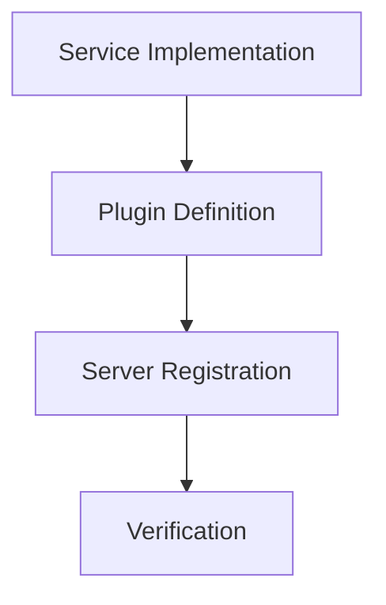

# 任务拆解文档：文本分块服务 MCP 工具化

## 1. 任务清单

### Task 1: 创建 TextSplitterService
- **文件**: `app/services/text_splitter_service.py`
- **依赖**: 无
- **描述**: 移植 `doc_spliter.py` 的逻辑到 `TextSplitterService` 类。包含所有辅助函数和主逻辑。
- **验收标准**: `TextSplitterService.split` 方法可正常调用，输出符合预期。

### Task 2: 创建 TextSplitterPlugin
- **文件**: `app/plugins/text_splitter.py`
- **依赖**: Task 1
- **描述**: 定义 MCP 工具 `text_splitter`，调用 Service 层。
- **验收标准**: 工具定义正确，参数提示正确。

### Task 3: 注册插件
- **文件**: `app/mcp/server.py`
- **依赖**: Task 2
- **描述**: 在 `init_mcp` 中导入新插件。
- **验收标准**: 服务器启动无报错。

### Task 4: 验证与测试
- **文件**: `tests/test_text_splitter.py` (新建)
- **依赖**: Task 3
- **描述**: 编写单元测试，验证各模式下的分块功能。
- **验收标准**: 所有测试用例通过。

## 2. 依赖关系图

